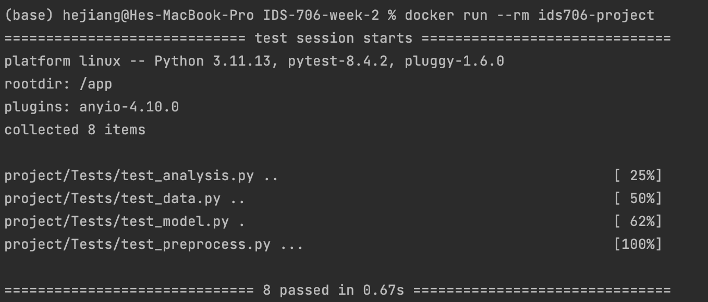
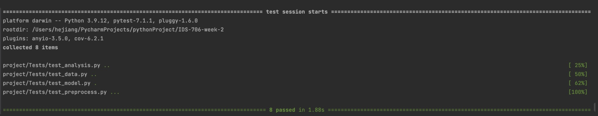
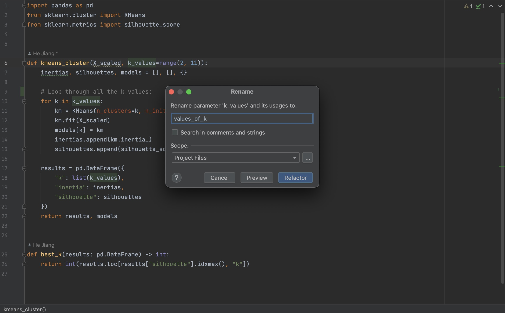
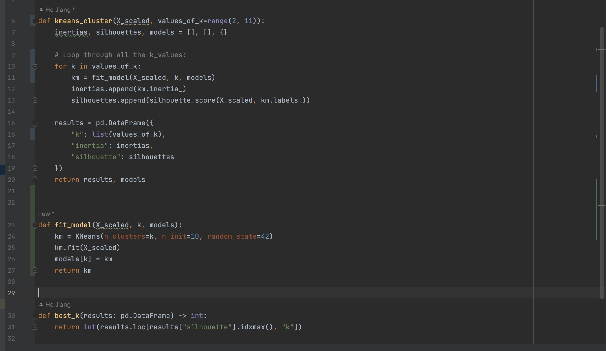
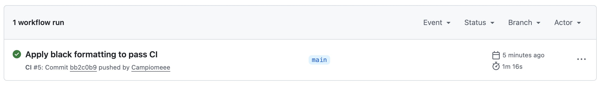

# 1. IDS-706-week-2-Analysis

This project investigates global AI job market and salary trends. 
The key question is: What factors drive salary differences across roles, 
experience levels, and regions? Answering this provides value for 
job seekers, employers, and policymakers who want to understand 
compensation in AI careers.

## 🚀  This project will:
    
    Use a dev container, Makefile, and GitHub Actions
    
    Use data set of Global AI Job Market & Salary Trends 2025 (Source: https://www.kaggle.com/datasets/bismasajjad/global-ai-job-market-and-salary-trends-2025?select=ai_job_dataset.csv)
    
    Do an analysis on the data set with the following steps:
        1.Import the Dataset
        2.Inspect the Data
        3.Display the first few rows using .head() to get a quick overview.
        4.Use .info() and .describe() to understand data types and summary statistics.
        5.Check for missing values and duplicates.
        6.Basic Filtering and Grouping of high salary group of people and average of different roles.
        7.Apply K-mean to cluster people with different levels of salaries.
        8.Apply Linear regression to find the relationship between the colunns salary_usc and years_experience.
        9.Visualize the results of both models with different plots.

## 🧹 Data Cleaning
- Removed missing values in `salary_usd` and `years_experience`.  
- Dropped outliers (salaries below $10k or above $1M).  
- Standardized categorical columns (job titles, countries).  
- Checked for and removed duplicate job postings. 

Run the requirements.txt which contains the following packages:
create a requirements.txt file with:
pandas
numpy
matplotlib
yfinance
pytest
flake8
seaborn
jupyter
scipy
scikit-learn

The Second Part of the project: Pytest and container.
# 2. IDS 706 Week 2 Project – Reproducibility & Testing

This repository contains a **data analysis pipeline** that has been made reproducible and testable using **unit tests** and **containerization**.  

---

## 🚀 Features
- **Modular Codebase**: Split into `data`, `preprocess`, `analysis`, and `model` modules.  
- **Unit & System Tests**: Cover data loading, cleaning, grouping, preprocessing, and machine learning model behavior.  
- **Containerized Environment**: Runs consistently with either **Docker** or **Dev Container** (VS Code).  
- **CI-Ready**: Easily extendable to GitHub Actions or other CI/CD tools.  

---
### created a Dockerfile with 

FROM python:3.11-slim

WORKDIR /app

COPY requirements.txt .
RUN pip install --no-cache-dir -r requirements.txt

COPY . .

ENV PYTHONPATH=/app

CMD ["pytest"]

### Write down test files for each of the modules:
 test_analysis.py

 test_date.py

 test_model.py

 test_preprocess.py

## 🚀 Quickstart
Clone the repo:
git clone https://github.com/Campiomeee/IDS-706-week-2.git

cd IDS-706-week-2

## Run locally

Copy code

make format

make lint

make test

python run.py
## Run with Docker:
docker build -t ids706-project .
docker run --rm ids706-project
## 📂 Repository Structure!
project/
init.py
data.py
preprocess.py
analysis.py
model.py
tests/
test_data.py
test_preprocess.py
test_analysis.py
test_model.py//
workflows/ci.ymal/
requirements.txt
Makefile
Dockerfile
README.md
IDS_706_Week2_Analysis.ipynb

## Test reulst && Screenshots:

Run with docker:

Run locally:

Comparison of refactoring:

Extract Method:

CI Workflow:

## 📈 Key Takeaways
- Experience level is the strongest driver of salary differences.  
- Senior ML/AI roles cluster together with higher salaries.  
- US-based jobs offer the highest salaries compared to other regions.  
- Regression models confirm a strong positive correlation between years of experience and salary.  

## 🔮 Future Work
- Add more ML models (RandomForest, XGBoost).  
- Incorporate geographic features for deeper regional analysis.  
- Extend visualizations to interactive dashboards (Plotly/Streamlit).